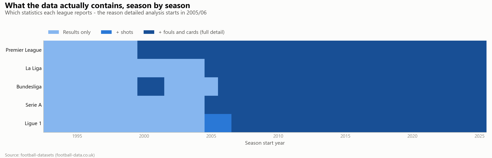
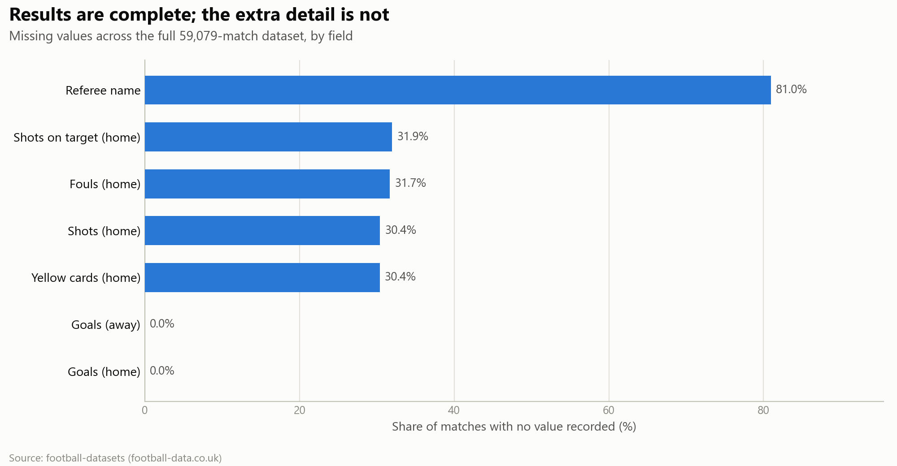
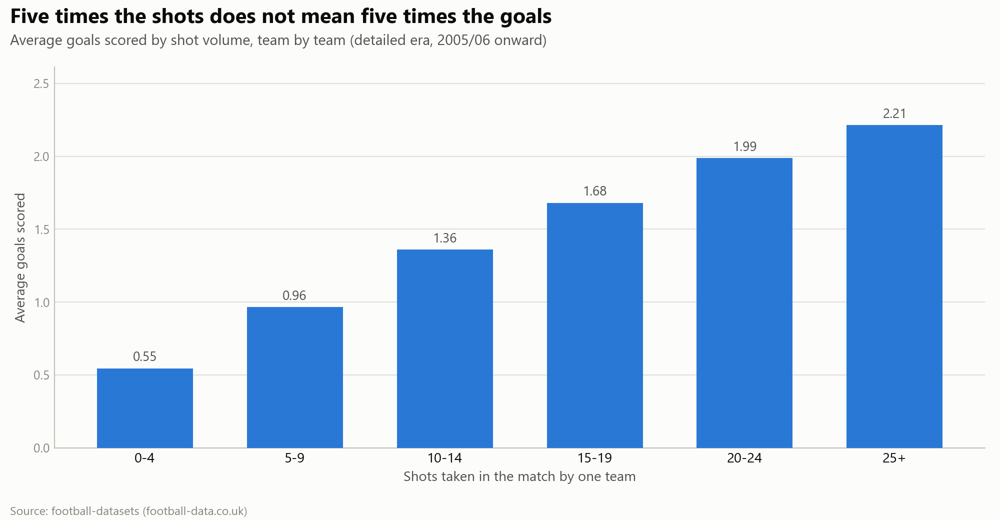

# 30 Years of European Football ⚽

**More goals, fewer draws — and what changed in the VAR era?**

A data visualization final project for the Data Visualization course (תשפ״ו), analyzing how
European football changed across the "big five" leagues — Premier League, La Liga, Bundesliga,
Serie A and Ligue 1 — from 1993/94 to 2025/26.

Claims like *"the modern game is more attacking"*, *"there are fewer draws than there used to be"*
and *"VAR changed refereeing"* are common in football media, but they usually rest on memory and
impressions. This project tests them against **59,079 real matches across 33 seasons**.

## Research questions 🥅

> **How has European football changed over the last three decades in terms of match outcomes,
> attacking trends, and refereeing patterns in the VAR era?**

Supporting questions:

1. Has the draw rate declined over time across the five leagues?
2. Has the average number of goals per match increased?
3. Is the change in goals related to shot volume or to finishing efficiency?
4. Did the cards-per-foul ratio change after VAR was introduced?
5. Are the observed patterns consistent across leagues, or do they differ?
6. *(Supporting)* How did home advantage change over the period, and what happened during the
   COVID-19 season when many matches were played without crowds?

## Key findings 📊

| Measure | Early period (1993–99) | Recent period (2020–26) |
|---|---|---|
| Draw rate | 28.5% | 25.4% |
| Goals per match | 2.63 | 2.82 |

**Cards per foul, after VAR was introduced** — the ratio rose in *all five* leagues, though the
size of the change varies considerably:

| League | Change in cards per foul (Post-VAR) |
|---|---|
| La Liga | +6.0% |
| Premier League | +15.6% |
| Serie A | +20.2% |
| Ligue 1 | +29.0% |
| Bundesliga | +44.7% |

> These are observational comparisons. A before/after difference is treated as an association
> with the VAR era, not as proof that VAR alone caused the change — other rule and style changes
> happened over the same period.

## Exploring the data

Before designing the dashboards, the dataset had to be understood: what it actually contains,
where it is incomplete, how the core variables behave, and which measures would survive those
limits. The preprocessing script renders that exploration into [`plots/`](plots).

**These charts are not the project's findings** — the findings are presented in the Tableau
dashboards and story. These document the reasoning that led to them.

**What the data contains, and when**

Shot statistics only become available across all five leagues in 2005/06, and fouls arrive later
still in Ligue 1. This chart is the reason detailed analysis is restricted to a common era, and
why foul-based measures skip the seasons that lack fouls.



**Where the data is missing**

Results are complete for all 59,079 matches, but roughly a third lack shots, fouls and cards, and
the referee's name is absent for four matches in five — which is why no headline finding rests on
individual referees.



**Why finishing is measured as goals per shot**

Taking five times as many shots does not produce five times as many goals. Shot volume alone is a
poor proxy for attacking quality, so the project measures conversion instead of counting shots.



Also in the folder: matches per season by league (league sizes and format changes), the
distribution of goals per match, and the home win / draw / away win split per league.

## Data

**Source:** [`github.com/datasets/football-datasets`](https://github.com/datasets/football-datasets)
(built from football-data.co.uk).

After merging and cleaning:

- **59,079 matches** · **5 leagues** · **33 seasons** · **1993/94–2025/26**
- Built from **165 raw season CSV files** (5 leagues × 33 seasons)

The raw data contains match results for the whole period, plus detailed statistics (shots, shots
on target, fouls, yellow/red cards) for later seasons. Because those detailed fields are missing
in the earliest seasons, shot- and card-based analyses are restricted to the **common detailed
era beginning 2005/06**, when all five leagues report match statistics.

> **Known data caveat:** the statistic families do not all start together. Ligue 1 reports shots
> from 2005/06 but no fouls before 2007/08, so foul-based measures simply skip those matches
> rather than shortening the detailed era for every other league. This is logged explicitly by
> the preprocessing script.

## Preprocessing

Data preparation is written in **Python 3 / pandas**. The pipeline:

1. clones the public dataset repository (sparse checkout of the five league folders);
2. merges all 165 season files, adding `League`, `Season` and `SeasonStartYear`;
3. parses dates, coerces numeric columns and drops rows missing core result/team fields;
4. engineers match-level features — `TotalGoals`, `GoalDiff_HomeMinusAway`, `HomeWin`/`AwayWin`/
   `Draw` flags, and per-family availability flags for shots, fouls and cards;
5. determines the common detailed era across all five leagues;
6. computes shot accuracy (on target per shot) and shot conversion (goals per shot);
7. aggregates to league-season level, including draw rate, goals per match and home advantage;
8. labels every match `Pre-VAR` / `Post-VAR` using each league's real VAR introduction season;
9. computes `CardsPerFoul = (yellow + red cards) / total fouls`;
10. writes all analysis tables, the summary charts, and `PROCESSING_LOG.txt`.

**Why cards per foul, and not raw card counts?** A raw count cannot distinguish *more cards
because more fouls were committed* from *more cards for the same number of fouls*. Normalizing by
fouls isolates the change in sanctioning intensity.

**VAR introduction seasons** (external documented fact, not part of the dataset — used only to
split the Pre/Post periods):

| League | VAR introduced |
|---|---|
| Bundesliga | 2017/18 |
| Serie A | 2017/18 |
| La Liga | 2018/19 |
| Ligue 1 | 2018/19 |
| Premier League | 2019/20 |

### Running the pipeline

```bash
pip install pandas numpy matplotlib
python football_preprocessing.py
```

The raw dataset is downloaded automatically on first run. Optional arguments:

```bash
python football_preprocessing.py --data-dir ./raw_data --out-dir ./processed_data --plots-dir ./plots
python football_preprocessing.py --skip-plots      # data tables only
```

Data tables are written to `processed_data/`. Tables used directly by the Tableau workbook:

| File | Used by |
|---|---|
| `season_league_summary.csv` | Dashboard 1 + story (draw rate, goals, home advantage) |
| `match_level_detailed.csv` | Dashboard 1 (shot efficiency drill-down) |
| `var_technology_effect.csv` | Dashboard 2 (cards per foul, pre vs post VAR) |
| `covid_league_comparison.csv` | Story (home advantage without crowds) |
| `var_home_bias_footnote.csv` | Story (secondary cross-check) |

Supplementary tables are also produced for completeness: `match_level_full.csv`,
`team_season_summary.csv`, `referee_summary.csv`, `attacking_evolution_summary.csv`.

## Visualizations 🏟️

Built in Tableau — **two dashboards plus a story**, using worksheets, filters, tooltips and
linked filter/highlight actions between views.

### Dashboard 1 — 30 Years of Change: Goals & Draws

How match outcomes and attacking play changed over time. The main view plots draw rate and goals
per match **season by season** across all 33 seasons — deliberately not grouped into multi-year
buckets, so genuine season-to-season swings stay visible; a separate KPI summary handles the
period comparison. A shot-efficiency drill-down then asks *why* scoring rose: more shots, or
better finishing?

*Interaction:* selecting a league filters the dashboard to that league; tooltips give exact values.

### Dashboard 2 — Before vs. After VAR: Refereeing Patterns

Whether refereeing patterns changed after VAR arrived. The main chart compares cards per foul
Pre-VAR vs Post-VAR **for each league separately**, since VAR arrived in different seasons.
Supporting views show fouls per match (to check the change is not simply more fouling) and a
timeline of each league's VAR introduction.

*Interaction:* selecting a league highlights it across the supporting views.

### Story — How 30 Years Changed European Football

Connects both dashboards into one narrative: the big question → the goals and draws trend → what
changed in attack → entering the VAR era → home advantage as a supporting theme → the COVID
season, when many matches were played without crowds.

COVID is used as **supporting context for the home-advantage chapter**, not as an explanation for
the attacking or VAR findings.

### Live on Tableau Public

- **Dashboard 1 — 30 Years of Change: Goals & Draws:**
  https://public.tableau.com/views/Dashboard1-30YearsofChangeGoalsandDraws/DashB1-TheAttackingEvolution
- **Dashboard 2 — Before vs. After VAR: Refereeing Patterns:**
  https://public.tableau.com/views/Dashboard2-Beforevs_AfterRefereeingPatterns/Dashboard3
- **Story — How 30 Years Changed Football:**
  https://public.tableau.com/views/Story-How30YearsChangedFootball/Story1

## Repository contents

| File | Description |
|---|---|
| `football_preprocessing.py` | Preprocessing pipeline and data-exploration charts — documented and reproducible |
| `plots/` | Data-exploration charts rendered by the script |
| `README.md` | This file |

The packaged Tableau workbook and the final written report are added on completion.

## Tools

- **Data processing:** Python 3, pandas, NumPy, Google Colab
- **Data-exploration charts in this repository:** matplotlib
- **Project visualizations:** Tableau Desktop, Tableau Public

No custom JavaScript/D3 code was used — all project visualizations are built in Tableau, and the
Python layer handles data preparation and the exploration charts above.

## Team 🏆

Yousef Shihade · Shada Essawi · Fidaa Arrabi

Data Visualization — Final Project
